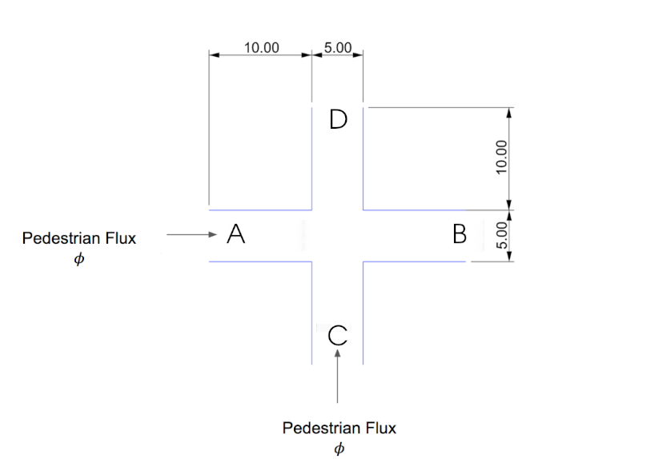

# XPedSimulator

# Usage

It is sufficient to run:

```python
python XPedSimulator.py
```

The following packages must be installed:

- **numpy**
- **matplotlib**

### Parameters

Within the [`main.py`](http://main.py) file, the following parameters can be changed:

```python
w=5 # Width of the path (and also of the actual intersection)
l=25 # Length of the path
b=0.25 # Radius of the circular space occupied by a single pedestrian
vmin=1.1 # Minimum pedestrian velocity [m/s]
vmax=1.3 # Maximum pedestrian velocity [m/s]
dt=0.1 # Timestep [s]
tMax=60 # [s]
phi=2 # Pedestrian Flux [pedestrian/s]
maxAcceleration=2 # Maximum acceleration [m/s^2]
```

### Output

After each iteration, the code export an image containing all the pedestrians in the domain and the trajectories that they followed up until that time-step.

All the images can be grouped into a video through **ffmpeg** (i.e. `ffmpeg -framerate 10 -pattern_type glob -i '*.png' -c:v libx264 -pix_fmt yuv420p outputName.mp4`)

The additional output is a csv file that contains the tuple$(x_{position}, y_{position}, v)$ for each pedestrian in each time-step. If a pedestrian is not in the domain at one time-step, (NaN. NaN, NaN) is outputted.

Each row contains the information for one pedestrian. Each column contains information for one time-step (except the first column, which contains the strings “AB” or “CD” according to the path that the pedestrian is following).

```python
+------+---------------+---------------+-----+---------------+
| Path | t0            | t1            | ... | tMax          |
+------+---------------+---------------+-----+---------------+
| CD   | (x0 y0 v0)    | (x1 y1 v1)    | ... | (NaN NaN NaN) |
+------+---------------+---------------+-----+---------------+
| AB   | (NaN NaN NaN) | (x0 y0 v0)    | ... | (NaN NaN NaN) |
+------+---------------+---------------+-----+---------------+
| AB   | (NaN NaN NaN) | (NaN NaN NaN) | ... | (xn yn vn)    |
+------+---------------+---------------+-----+---------------+
```

## Geometry



This geometry is hard coded in the code in the effort of making it more efficient. Only the dimensions (length and width) can be changed.

## Time-step

In this simulator, the time-step must be chosen according to three considerations:

- It must be low enough to introduce new pedestrian according to the prescribed pedestrian flux

$$
\phi=1/\Delta t_{min}
$$

⚠️ It is clearly possible to introduce more than one pedestrian at the same time step. The implementation of this strategy has not been carried out given the range of values of $\phi$ for which the code must work (up to $\phi=2$).

- The bigger the time-step, the more crossings of pedestrian trajectories are filtered out of the simulation

$$
\min \theta-\theta_0
\\
\max \alpha
$$

- Due to the implementation, the bigger is the time-step, the lower is the “spatial awareness” of the pedestrian. That is, the pedestrian trajectory evaluation is performed over a smaller region of space.

## Brief description of the implementation

### Insertion and removal of pedestrians

A new pedestrian is inserted in the simulation at the inlet “A” or “C” in a random position within the segment inlet (and considering the size of the pedestrian). If placing the pedestrian in the random position do not lead to an overlap with other pedestrians, then the insertion actually takes place, otherwise another position is searched.

⚠️ With an extremely high value of $\phi$ and low $\Delta t$, the insertion might fail if not enough space is available nearby the inlet. Again, given that $\phi \in [0.2, 2]$ this is not a problem.

At the same time, a characteristic velocity of the pedestrian is generated s.t. $v\in [v_{\min}, v_{\max}]$.

If the pedestrians is outside the domain after a time-step, it is removed from the simulation and its “history” is written to the .csv file.

### Motion of the pedestrian

The movement of pedestrians, without any obstacles, is simply linear at a constant velocity.

It is generally described by:

- A velocity (Which is characteristic of the pedestrian and held constant throughout the simulation)
- An $\alpha$ coefficient that handles any slowing of the pedestrian and its return to its original velocity (that cannot increase)
- The angle of motion $\theta$. Basically it is $0$ for pedestrians moving from A to B and $\pi/2$ for those moving from C to D with temporary variations caused by obstacles.

The algorithm works as follows:

1. At the candidate position of the pedestrian is computed considering the maximum allowable acceleration (if the pedestrian is moving slower than its characteristic velocity) and the basic value of $\theta$ ($0$ or $\pi/2$)
    
    $\begin{cases}\alpha_{\max}=\min(1, \alpha_{old}+a_{\max}\Delta t/v) \\ x_{cand}=x_{old}+\alpha_{\max}v\cos(\theta)  \\ y_{cand}=y_{old}+\alpha_{\max}v\sin(\theta) \end{cases}$
    
2. The candidate position is compared with:
    1. all the pedestrians moving along the same path
    2. the pedestrians moving along the perpendicular path **and** at the intersection **only if** also the considered pedestrian is at the intersection
3. If no obstacle is found, then the candidate motion is the actual one and the position of the pedestrian is updated
4. If one or more obstacles are encountered, the pedestrian must choose its deceleration and a deviation $\delta \theta$. This is computed with a separate function `choosePath`.

**choosePath**

The candidate motion of the pedestrian is defined by the combination of these two lists:

$$
\begin{cases}\mathbf{\delta\theta_{list}}= [0:\Delta(\delta \theta):\delta\theta_{\max}]\\ \mathbf{\alpha_{list}}= [\alpha_{\min}:\Delta \alpha:\alpha_{\max}]\end{cases}
$$

$\alpha_{\max}$ is defined as before, $\alpha_{\min}=0$ since the pedestrian must be always able to avoid a collision (as in real life, it is able to do so stopping its motion). $\theta_{\max}$ is hard coded as $40 \deg$ after a process of trial and error with the goal of setting it at a value that would provide sufficient freedom of movement for the pedestrian. But if the pedestrian is almost still ($\alpha v <=0.25\ m/s$) than he must be able to change his trajectory much more, hence $\theta_{\max}=90 \deg$ and $\alpha_{\min}=\min(0, \alpha_{old}-a_{\max}\Delta t/v)$ (n this case the constraint on acceleration is maintained). With this choice (i.e., the ability to move back slightly), the formation of “clumps” of jammed pedestrians is avoided.

$\mathbf{\delta \theta_{list}}$ starts from 0 because, for each $\delta \theta$, both $\delta \theta$ and $-\delta \theta$ are evaluated.

The pawn can move based on any of the combinations of the two lists. Then, the combination matrix is constructed and sorted based on the combinations that maximize $\alpha\cos(\delta \theta)$ (hence that maximise the movement of the pedestrian towards the outlet). In the case of $\alpha v <=0.25\ m/s$, since backing off slightly is to be preferred  over staying stationary, the absolute value of $\alpha$ is considered.

The ordered list of combinations is evaluated until the yielding candidate position:

- Do not lead to a collision with other pedestrian
- Do not lead to a collision (or bypassing) of the walls

Furthermore, since $\alpha\cos(\delta \theta)=\alpha\cos(-\delta \theta)$, both $\delta \theta$ and $-\delta \theta$ are evaluated. The feasible deviation that bring the pedestrian further from the wall (with respect to the position of the pedestrian at the beginning of the step) is chosen.

## Test cases